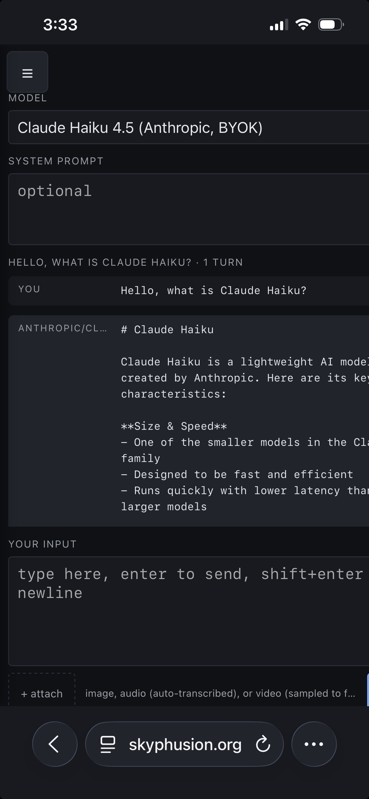

# skyphusion-llm-public

[](LICENSE)
[](https://github.com/SkyPhusion/skyphusion-llm-public/actions/workflows/typecheck.yml)

A multimodal AI playground deployed as a single Cloudflare Worker. Chat across 39 text models from six providers, generate images, speech, videos, and music, transcribe audio, and run retrieval-augmented chat over your own PDFs and spreadsheets. One web UI behind Cloudflare Access; per-user history; R2 for all binary artifacts.

<p align="center">
  <br><br>
  
</p>

## What this is

A working template for the Cloudflare AI stack. One Worker, no framework, no build step beyond TypeScript. The interesting parts are the patterns, not the model count:

- **Unified `env.AI.run()` binding** drives every modality through one call surface: chat, vision input, image gen, TTS, STT, video gen (Unified Billing), and music gen.
- **BYOK paths** for Anthropic Claude, xAI Grok, Google Gemini, OpenAI GPT, and Amazon Bedrock (Nova family plus TwelveLabs Pegasus 1.2). Each provider has its own dispatch helper that transforms our internal `messages` shape into the provider's format.
- **AI Gateway** wraps every call for observability, caching, and rate-limiting.
- **D1** holds chat metadata, multi-turn conversation history, and RAG chunk text. **R2** holds all binary artifacts. **Vectorize** holds RAG embeddings (768-dim BGE-base). The chat row references R2 keys; nothing binary touches D1.
- **Cloudflare Workflows** owns long-running Unified Billing video and music generation (30s to 3min jobs). The `LongRunWorkflow` class holds the blocking `env.AI.run` call alive across step boundaries that `ctx.waitUntil` cannot.
- **Cloudflare Access** gates the entire worker URL. The worker reads `Cf-Access-Authenticated-User-Email` to scope history per user; R2 objects carry `customMetadata.user_email` so cross-user access is impossible even if a UUID is guessed.
- **Client-side video keyframe extraction** sends 8 evenly-spaced frames to vision-capable chat models instead of uploading the full video file. The exception is TwelveLabs Pegasus 1.2 on Bedrock, which takes the raw video file directly for proper temporal understanding (18MB cap per the Bedrock InvokeModel request limit).

## Features

**Chat (39 models across 6 providers):**
- Workers AI: Llama 4 Scout, Llama 3.x, Qwen 3 / 2.5, DeepSeek R1, Mistral, Gemma 4, Granite 4, Nemotron 3, GLM 4.7, Hermes, GPT-OSS 120B/20B, Kimi K2.6
- Anthropic BYOK: Opus 4.7 / 4.6, Sonnet 4.6, Haiku 4.5
- xAI BYOK: Grok 4.3, Grok 4.20 (multi-agent and reasoning variants), Grok Build 0.1
- Google BYOK: Gemini 3.5 Flash, 3.1 Pro / Flash, 2.5 Pro
- OpenAI BYOK: GPT-5.5, GPT-5.4, GPT-5.4 mini
- Bedrock BYOK: Nova 2 Lite/Pro, Nova Lite/Pro, TwelveLabs Pegasus 1.2 (video-Q&A)

**Image generation:** FLUX 2 Klein 9B/4B, FLUX 2 Dev, FLUX-1 schnell, Lucid Origin, Phoenix 1.0, Dreamshaper 8 LCM, OpenAI GPT Image 2 (BYOK).

**Video generation:** Google Veo 3.1 / 3.1 Fast / 3 / 3 Fast, ByteDance Seedance 2.0 / 2.0 Fast, MiniMax Hailuo 2.3 / 2.3 Fast, RunwayML Gen-4.5, Alibaba HappyHorse 1.0, PixVerse v6 / v5.6, Vidu Q3 Pro / Q3 Turbo, xAI Grok Imagine Video. BYOK for xAI and the Veo 3.1 family; Unified Billing for the rest (durable via Cloudflare Workflows).

**Music generation:** MiniMax Music 2.6 (Unified Billing, durable via Workflows).

**Text-to-speech:** Aura-2 EN / ES, MeloTTS, OpenAI GPT-4o mini TTS (BYOK).

**Speech-to-text:** Whisper Large v3 Turbo / Whisper / Whisper Tiny EN, OpenAI GPT-4o Transcribe and mini Transcribe (BYOK).

**RAG (Vectorize):** upload `.txt`, `.md`, `.pdf`, or `.xlsx`/`.xls` files via the sidebar. The worker chunks, embeds via BGE-base, and stores vectors in Vectorize plus text in D1. Per-page metadata for PDFs, per-sheet for XLSX. Toggle "use my docs" per turn to fold the top-5 nearest chunks into the system prompt before the LLM call.

**Multi-turn conversations:** `conversation_id` plus `turn_index` on chat rows. Continuing a conversation pulls prior turns and assembles a full message history for the next call. Mixed-model conversations allowed (start with Llama, continue with Claude). Text-only on continuation; prior images, audio, and video are not re-sent.

**UI:** capability-aware mode switching (vision-only attachment types; image-mode UI re-skin to "negative prompt"; TTS / STT / video / music hide irrelevant inputs), per-user replay-able history with attachments and generated artifacts, optgrouped model dropdown, Enter to send / Shift+Enter for newline.

**Auth:** Cloudflare Access on the worker URL. Per-user history and R2 ownership checks via `Cf-Access-Authenticated-User-Email`. Free up to 50 seats on Zero Trust.

## Stack

- One Worker, TypeScript, no framework
- `env.AI` unified binding routed through Cloudflare AI Gateway
- D1 for chat history rows and RAG chunk text
- R2 for input and output artifact bytes
- Vectorize for RAG embeddings (768-dim, cosine)
- Cloudflare Workflows for long-running Unified Billing video and music generation
- Static frontend served via Workers Assets
- Cloudflare Access in front for auth

Roughly 3100 LOC in TypeScript, plus ~1800 LOC of vanilla JS, CSS, HTML, and SQL.

## Quickstart

Prerequisites:

- Cloudflare account with Workers, D1, R2, AI Gateway, and Workers AI enabled
- Node.js 18 or later
- Workers Paid plan if you plan to exceed the free Workers AI tier (10,000 neurons per day across all model usage), and required as of v0.11.0 for the `unpdf` bundle size

```
git clone https://github.com/SkyPhusion/skyphusion-llm-public.git
cd skyphusion-llm-public
npm install
npm run bootstrap
```

`npm run bootstrap` copies `wrangler.example.toml` (the committed template) to `wrangler.toml` (your per-deployer config; gitignored). The committed template gains new bindings across versions; your `wrangler.toml` keeps your deployer-specific IDs across pulls. See [Upgrading across versions](#upgrading-across-versions) below for the convention.

### 1. Create the AI Gateway

Dashboard > AI > AI Gateway > Create Gateway. Name it anything. Copy the slug from the URL after creation. Then set it as a worker secret:

```
echo "your-gateway-slug" | npx wrangler secret put GATEWAY_ID
```

For local development, also add it to `.dev.vars` so `wrangler dev` picks it up:

```
echo "GATEWAY_ID=your-gateway-slug" >> .dev.vars
```

`.dev.vars` is gitignored.

### 2. Create the D1 database

```
npm run db:create
```

Paste the returned `database_id` into `wrangler.toml` at `[[d1_databases]] database_id`. Then apply the schema:

```
npm run db:migrate:remote
npm run db:migrate:local
```

### 3. Create the R2 bucket

```
npx wrangler r2 bucket create skyphusion-llm-public
```

No further config needed; the binding is already in `wrangler.example.toml` (and therefore in your `wrangler.toml` after bootstrap).

### 4. Create the Vectorize index

For RAG over PDFs and spreadsheets:

```
npx wrangler vectorize create skyphusion-llm-vec --dimensions=768 --metric=cosine
```

The `VEC` binding is already in the template. If you don't intend to use RAG, the worker still functions; the binding just goes unused.

### 5. First deploy

```
npm run deploy
```

You will get a `*.workers.dev` URL.

### 6. Cloudflare Access

Dashboard > Zero Trust > Access > Applications > Add an application > Self-hosted. Application domain is your worker URL. Identity providers: enable at least one (Google, GitHub, One-Time PIN, etc.). Policy: Action Allow, Rules > Emails > include your address and anyone else who should have access.

Cloudflare Zero Trust is free up to 50 seats, so a small team is free.

After this, hitting the worker URL shows the Access login screen. Authenticated requests reach the worker with `Cf-Access-Authenticated-User-Email`, which scopes both history and R2 artifact access per user.

### 7. Local development

`wrangler dev` does not run Cloudflare Access. The worker falls back to `user_email = 'anonymous'` for local runs. Do not expose your local dev port to the public internet.

```
npm run dev
```

## Upgrading across versions

`wrangler.toml` is gitignored from v0.12.0 on. The repo ships `wrangler.example.toml` as the canonical template. When you pull a new release, your `wrangler.toml` is untouched, but the example template may have gained new bindings (e.g., v0.12.0 added `[[workflows]]` and `[observability]`). To apply those:

```
diff wrangler.toml wrangler.example.toml
```

Each version that touches `wrangler.example.toml` documents the exact TOML blocks to paste in the corresponding [CHANGELOG.md](CHANGELOG.md) entry under a "wrangler.toml migration" heading. Apply those blocks to your local `wrangler.toml` and redeploy.

## Architecture

```
                    Browser (Cloudflare Access login)
                              |
                              v
                    Worker (single fetch handler)
                    /        |         \
                  AI         D1          R2
              (Gateway)  (metadata)  (artifact bytes)
```

The worker is the only public surface. R2 is private; the worker streams objects through `GET /api/artifact/*` after verifying ownership via `customMetadata.user_email` on the R2 object.

### Routes

| Method | Path | Purpose |
|---|---|---|
| GET    | `/api/models`       | List available models with capability flags |
| POST   | `/api/chat`         | Run a model. Dispatches by model type. |
| GET    | `/api/history`      | List the caller's chats |
| GET    | `/api/history/:id`  | One chat row with full attachment + output references |
| DELETE | `/api/history/:id`  | Delete a chat row and clean up its R2 objects |
| GET    | `/api/artifact/*`   | Stream an R2 object, gated by ownership |

### Model types

- `chat`: text generation. Accepts vision attachments on vision-capable models. Audio attachments are transcribed via Whisper. Video attachments are 8 client-extracted keyframes.
- `image`: text-to-image generation. The system prompt field becomes the negative prompt. Output is a JPEG in R2.
- `tts`: text-to-speech. Output is audio (MP3 or model-default container) in R2.
- `stt`: speech-to-text transcription. Input audio, output text.
- `video`: text-to-video generation. Long-running (30s-3min); see "Long-running jobs" below.
- `music`: text-to-music generation. Long-running (30s-90s); see "Long-running jobs" below.

### Long-running jobs

Video and music generation can take 1-3 minutes per call, which exceeds the ~30-second post-response budget that Cloudflare Workers gives to `ctx.waitUntil`. Two architectures handle this:

**BYOK video** (xAI Grok Imagine Video, Google Veo with your API key) uses submit-and-poll: the worker submits the job synchronously (one fast HTTP call), persists the upstream job ID, and returns immediately. Each client poll of `/api/job/:id` triggers ONE fresh worker invocation that checks upstream status; when done, that invocation downloads to R2 and finalizes D1.

**Unified Billing video and music** (Veo/Seedance/Hailuo/Gen-4.5/HappyHorse/PixVerse/Vidu/MiniMax Music via Cloudflare credits) uses [Cloudflare Workflows](https://developers.cloudflare.com/workflows/). The `LongRunWorkflow` class (defined at the bottom of `src/index.ts`) holds the blocking `env.AI.run` call alive across step boundaries and retries each phase independently. Workflow instance IDs are stored on the chats row as `job_id` for traceability.

The `[[workflows]]` binding in `wrangler.toml` declares this. Two operational notes:

- Workflows are not supported in `wrangler dev --remote`. Local dev mode is fine; deploy to test the Unified Billing video and music paths.
- To inspect a stuck job: `npx wrangler workflows instances describe skyphusion-longrun <job_id>` shows the per-step status, retry count, and any error messages.

## Multimodal handling

**Images.** Native `image_url` content blocks to vision-capable chat models. Downscaled to 1280px max dimension client-side. 4 MB raw cap.

**Audio.** Transcribed via `@cf/openai/whisper-large-v3-turbo` before the model call. Transcript text is prepended to the user message. Raw audio is dropped (not stored). 20 MB cap.

**Video.** Client-side keyframe extraction via HTML5 video + canvas. Eight evenly-spaced frames are pulled at upload time and sent as image content blocks to a vision-capable chat model. The original video file is never uploaded to the worker. This is sampled-frames understanding, not true temporal video reasoning. For true video, route through Gemini 2.5/3 Pro via the AI Gateway third-party path. 100 MB cap is a browser-side sanity limit.

## Storage and cost

D1 holds metadata and structured JSON pointing to R2 keys. R2 holds binary bytes. Each R2 object carries `customMetadata.user_email` for ownership checks. `DELETE /api/history/:id` cleans up the corresponding R2 objects best-effort.

Workers AI billing is per-token / per-image / per-minute depending on model. Free tier is 10,000 neurons per day across all Workers AI usage. Image generation burns through neurons faster (roughly 1,600 to 6,400 per image). Beyond the free tier, the Workers Paid plan is required at $5/month, with usage at $0.011 per 1,000 neurons.

D1 is roughly $0.75/GB-month for storage. R2 is roughly $0.015/GB-month with no egress fees inside Cloudflare. Free tiers on D1 and R2 cover small personal use indefinitely.

Anthropic (Claude), xAI (Grok), and Google (Gemini) models bill against your own provider accounts via BYOK, not Cloudflare. See below.

## Anthropic models (BYOK)

The Anthropic entries in the model menu (Claude Opus 4.6, Sonnet 4.6, Haiku 4.5) are routed via BYOK (Bring Your Own Key) rather than Cloudflare Unified Billing. The `env.AI.run()` binding doesn't support BYOK for third-party models, so the worker hits the AI Gateway's Anthropic provider endpoint directly with Anthropic-native payloads. The gateway still wraps the call for observability, caching, and rate-limiting.

There are two ways to authenticate, and the worker supports both:

### Option A (recommended): Store the key in AI Gateway

1. Get an API key from https://console.anthropic.com > Settings > API Keys > Create Key
2. Dashboard > AI > AI Gateway > select your gateway > Provider Keys > Add API Key > pick Anthropic > paste
3. Redeploy: `npm run deploy`

The worker sends the request without an `x-api-key` header; the gateway injects the stored key before forwarding to Anthropic. Keys live in Cloudflare Secrets Store, are rotatable in one place, and never appear in worker secrets.

### Option B: Inline secret

1. Get the key as above
2. Load it as a Worker secret:
   ```
   npx wrangler secret put ANTHROPIC_API_KEY
   ```
3. Redeploy

The worker sends the key as `x-api-key` on every request. This overrides any stored key at the gateway level.

### Authenticated Gateway

If your gateway has Authenticated Gateway enabled (recommended for production), also set:
```
npx wrangler secret put CF_AIG_TOKEN
```
The worker will include the `cf-aig-authorization` header automatically when this is set.

Billing: Anthropic charges your account at their per-token rates. There's no Cloudflare markup on BYOK calls; the gateway just proxies. Caching at the gateway level can reduce duplicate-prompt costs.

## xAI / Grok models (BYOK)

Grok 4.3, Grok 4.20 (Multi-Agent and Reasoning variants), and Grok Build 0.1 are routed via BYOK against your own xAI account. Same patterns as Anthropic above: stored keys in the gateway dashboard (recommended) or inline Worker secret. xAI is OpenAI-compatible so no message transform is needed.

### Option A (recommended): Store the key in AI Gateway

1. Get an API key from https://console.x.ai > API Keys > Create API Key
2. Dashboard > AI > AI Gateway > Provider Keys > Add API Key > pick xAI > paste
3. Redeploy

### Option B: Inline secret

```
npx wrangler secret put XAI_API_KEY
npm run deploy
```

The same `CF_AIG_TOKEN` secret applies if your gateway is authenticated.

Note: Grok 4.x are reasoning models and expect `max_completion_tokens` rather than the legacy `max_tokens` field. The worker handles this internally. If you swap in older Grok variants (the grok-3 family was retired May 15, 2026), check xAI's docs for which field they expect.

Billing: xAI charges your account directly. Pricing as of mid-2026: Grok 4.3 and Grok 4.20 variants at $1.25/$2.50 per million input/output tokens, Grok Build 0.1 at $1.00/$2.00. No Cloudflare markup.

## Google Gemini models (BYOK)

Gemini 3.5 Flash, Gemini 3.1 Pro, Gemini 3.1 Flash, and Gemini 2.5 Pro are routed via BYOK against your own Google AI Studio account. Same pattern as Anthropic and xAI: stored keys in the gateway dashboard (recommended) or inline Worker secret.

Google's API differs from OpenAI: messages live in a `contents` array of `parts` blocks, system prompts go in `systemInstruction`, images use `inline_data` blocks, and the assistant role is called `model`. The worker handles the transform internally; the same UI works for all four providers.

### Option A (recommended): Store the key in AI Gateway

1. Get an API key from https://aistudio.google.com > Get API key
2. Dashboard > AI > AI Gateway > Provider Keys > Add API Key > pick Google AI Studio > paste
3. Try a Gemini model; the gateway injects the stored key automatically

### Option B: Inline secret

```
npx wrangler secret put GOOGLE_API_KEY
npm run deploy
```

The worker sends `x-goog-api-key` on every request, overriding any stored key.

Billing: Google charges your account directly. Gemini 3.5 Flash and Gemini 3.1 Flash are roughly $0.30/$2.50 per million input/output tokens, Gemini 3.1 Pro is higher (premium reasoning tier), Gemini 2.5 Pro is at the older 2.5-family pricing. Check https://ai.google.dev/pricing for current rates.

## OpenAI models (BYOK)

OpenAI chat models route through Cloudflare AI Gateway's OpenAI proxy, using the standard `messages` array format. v0.11.0 ships GPT-5.5, GPT-5.4, GPT-5.4 mini, and GPT-4.1 in the catalog.

Set the API key as a worker secret:
```
npx wrangler secret put OPENAI_API_KEY
npm run deploy
```

Billing: OpenAI charges your account directly per https://openai.com/api/pricing/. GPT-5.5 Pro is premium-tier; GPT-5.4 mini is a good speed/cost daily driver. The worker sends `Authorization: Bearer $OPENAI_API_KEY` on every request, no stored-key fallback.

## Amazon Bedrock models (BYOK)

v0.11.0 adds Bedrock support via AWS SigV4 signing using the `aws4fetch` library. Two model families are wired up:

**Nova (Amazon's chat models)**: Nova 2 Lite, Nova 2 Pro, Nova Lite, Nova Pro. All routed through Bedrock's Converse API, which normalizes request/response shapes across model families.

**Pegasus 1.2 (TwelveLabs video-Q&A)**: Single-shot video understanding. Takes a video file + prompt, returns text analysis. Uses Bedrock's `InvokeModel` endpoint with a video-specific request body.

### Setup

```
npx wrangler secret put AWS_ACCESS_KEY_ID
npx wrangler secret put AWS_SECRET_ACCESS_KEY
```

Optionally set `AWS_REGION` (defaults to `us-east-1`) and `AWS_REGION_PEGASUS` (defaults to `us-west-2`, since Pegasus has tighter regional availability than Nova):

```
npx wrangler secret put AWS_REGION
npx wrangler secret put AWS_REGION_PEGASUS
```

### IAM scoping (recommended)

Create an IAM user with only Bedrock invoke permissions. Attach a policy like:

```json
{
  "Version": "2012-10-17",
  "Statement": [{
    "Effect": "Allow",
    "Action": [
      "bedrock:InvokeModel",
      "bedrock:InvokeModelWithResponseStream"
    ],
    "Resource": "*"
  }]
}
```

The user must also have model access requested and approved in the Bedrock console (Console → Bedrock → Model access → Manage model access). Without explicit access, every invoke returns `AccessDeniedException`.

### Pegasus regional limits

Pegasus 1.2 is only generally available in `us-west-2` and `eu-west-1`. Cross-region inference from other US/EU regions can work but may add latency. If your Nova workloads run in `us-east-1` but you also want Pegasus, set `AWS_REGION=us-east-1` for Nova and `AWS_REGION_PEGASUS=us-west-2` for Pegasus.

### Pegasus video size limit

Bedrock's `InvokeModel` endpoint has a 25MB request payload limit. After base64 encoding, that's about 18MB of binary video. The frontend caps Pegasus uploads at 18MB and returns a clear error for larger files. To support bigger videos you'd integrate S3 (Pegasus accepts `s3Location` in `mediaSource` as an alternative to base64). Not implemented in this build.

### Pegasus in multi-turn conversations

Pegasus is fundamentally single-shot: one video + one prompt per call. If you continue a Pegasus conversation past the first turn, you must re-attach the video on each follow-up turn. The frontend will accept the upload but the worker won't reuse the prior turn's video from R2 automatically. A future iteration may auto-attach the prior turn's video on continuation.

### Billing

AWS charges your account directly per https://aws.amazon.com/bedrock/pricing/. Nova family is competitively priced (Nova 2 Lite is the cheapest at fractions of a cent per 1k tokens); Pegasus pricing is per-second of analyzed video duration.

## Video generation (dual-route: Unified Billing + BYOK)

Video models have two possible routes through the AI Gateway:

**Route A: Unified Billing via `env.AI.run`** (binding-based, 15 of 15 models). Cloudflare manages provider auth and bills your CF account directly. Requires opting into Unified Billing in the AI Gateway dashboard and funding it with credits. Per CF docs: BYOK is **not** supported for third-party models called through the AI binding.

**Route B: BYOK via per-provider AI Gateway endpoints** (3 of 15 models). Hits `/grok/v1/videos/*` and `/google-ai-studio/v1beta/*` directly with your stored xAI and Google keys. Works today without Unified Billing.

This deployment supports both. The router picks per-model based on a `byok_alias` field in the model catalog. If a model has `byok_alias` set and the provider is `xai` or `google`, the worker uses BYOK. Otherwise it uses `env.AI.run`, which will fail with code `2021: Invalid User Credentials` until Unified Billing is enabled.

### Model availability matrix

| Model | Route | Works today | Notes |
|---|---|---|---|
| `xai/grok-imagine-video` | BYOK | yes (with XAI_API_KEY) | $0.05/sec, 8s default |
| `google/veo-3.1-fast` | BYOK | yes (with GOOGLE_API_KEY) | aliases to `veo-3.1-fast-generate-001` |
| `google/veo-3.1` | BYOK | yes (with GOOGLE_API_KEY) | aliases to `veo-3.1-generate-preview` |
| `google/veo-3`, `google/veo-3-fast` | Unified | needs CF credits | no AI Studio direct equivalent listed |
| `bytedance/seedance-2.0`, `seedance-2.0-fast` | Unified | needs CF credits | CF partner, no public API |
| `minimax/hailuo-2.3`, `hailuo-2.3-fast` | Unified | needs CF credits | CF partner, no public API |
| `runwayml/gen-4.5` | Unified | needs CF credits | CF partner |
| `alibaba/hh1-t2v` | Unified | needs CF credits | image-to-video only |
| `pixverse/v6`, `v5.6` | Unified | needs CF credits | CF partner |
| `vidu/q3-pro`, `q3-turbo` | Unified | needs CF credits | CF partner |

The "needs CF credits" entries appear in the menu but will fail until you enable Unified Billing.

### Enabling Unified Billing

1. https://dash.cloudflare.com -> AI -> AI Gateway -> your gateway -> Settings
2. Find the Unified Billing section (open beta as of November 2025)
3. Enable it and purchase credits ($20 covers ~40-50 video gens depending on model)
4. No code change required; the existing `env.AI.run` path activates automatically once credits are available

### Architecture

Both routes share the same fire-and-forget pattern:

1. Client POSTs to `/api/chat` with a video model. Worker writes a `status='pending'` row to D1 and returns immediately with `{ id, status: "pending" }`.
2. Generation runs in the background via `ctx.waitUntil()`:
   - **Unified route:** single `env.AI.run("provider/model", ...)` call blocks until the video is ready, then we download and re-host.
   - **BYOK route:** submit to the per-provider endpoint, sleep+poll every 5s for up to 5 minutes, then download and re-host.
3. Background task uploads the video bytes to your R2 bucket and updates the D1 row to `status='done'`.
4. Client polls `GET /api/job/:id` every 5 seconds. This endpoint just reads D1 (no provider calls), so polling is essentially free.
5. Frontend renders `<video controls>` pointing at `/api/artifact/:key` once `status='done'`.

If the job fails at any stage (provider error, poll timeout, download failure, R2 upload error), the row gets `status='failed'` with a descriptive `job_error`. The history list shows a warning icon and the chat detail view shows the error message.

### Defaults

The worker submits with `duration: 8s`, `aspect_ratio: "16:9"`, `resolution: "720p"`, `generate_audio: true` for the Unified route. The BYOK route uses the xAI/Google-specific param shapes (`duration: 8` integer for xAI, `parameters: {durationSeconds, aspectRatio}` for Google). Per-model parameter customization is a v0.8.0 follow-on.

### Cost discipline

Video gen is the most expensive feature in this playground.

- The worker has no per-user rate limiting. If you make the URL public, add rate limits at the AI Gateway level.
- Each generation creates an R2 object (~5-30MB per 8s clip). Use `DELETE /api/history/:id` to clean up.
- BYOK route prices: xAI Grok Imagine Video $0.05/sec ($0.40 per 8s clip). Veo via Gemini AI Studio per Google's pricing page.
- Unified Billing prices: visible at https://dash.cloudflare.com under AI > Models > [model] > Pricing. CF marks up upstream provider costs.

### Image-to-video

Most of these models support image-to-video via an `image_input` parameter (base64-encoded reference image). The UI doesn't yet expose this; it's a v0.8.0 follow-on. The Alibaba HH1 model is image-to-video only; selecting it without supplying an image will fail.

## Speech-to-text (Whisper, standalone)

Attach an audio file, pick a Whisper model, click Run. The worker calls Whisper directly via `env.AI.run` (no async; Whisper completes in seconds) and stores the transcript as the chat's `output` text. The audio's bytes are not persisted; only the transcript is kept on the row's attachment record, same convention as the chat-path audio attachments.

Three Whisper variants are exposed:
- `@cf/openai/whisper-large-v3-turbo` (default; best quality, multilingual)
- `@cf/openai/whisper` (general purpose, slightly older)
- `@cf/openai/whisper-tiny-en` (fast, English-only, beta)

Whisper is hosted on Workers AI (no Unified Billing needed).

## Music generation (MiniMax Music 2.6)

Same fire-and-forget architecture as video gen, single model in the catalog: `minimax/music-2.6`. Generates full songs with vocals from a style/mood prompt and optional lyrics, or instrumental tracks. Output is an MP3 stored in R2.

Input fields:
- `user_input` -> `prompt` (style/mood/genre, ~10-300 chars). Example: `"Indie folk, melancholic, introspective, longing, solitary walk, coffee shop"`
- `system_prompt` -> `lyrics` (optional, ~10-3000 chars). Supports structure tags: `[Intro]`, `[Verse]`, `[Chorus]`, `[Bridge]`, `[Outro]`

This is a Cloudflare-proxied (third-party) model, so it requires Unified Billing on the gateway. It will fail with the same `2021: Invalid User Credentials` error as the other 12 video models until credits are funded.

## Editing the model menu

`MODELS` at the top of `src/index.ts`. Each entry has:

- `id`: `@cf/{vendor}/{model}` for Workers AI, `anthropic/{model}` for BYOK Anthropic, `xai/{model}` for BYOK xAI, or `google/{model}` for BYOK Google Gemini
- `label` for the dropdown
- `group` for the optgroup heading
- `type`: `"chat"` | `"image"` | `"tts"` | `"video"`
- `capabilities`: array. Currently only `"vision"` is recognized; applies to chat models only.
- `provider` (optional): `"workers-ai"` (default) | `"anthropic"` (BYOK) | `"xai"` (BYOK) | `"google"` (BYOK). Drives the call dispatch.

Full Workers AI catalog: https://developers.cloudflare.com/workers-ai/models/. Skip anything tagged "Planned deprecation."

## Migrating an existing deployment

If you deployed an earlier version, apply the schema deltas before redeploying. For v0.7.0 (video generation), add the job-state columns:

```
npx wrangler d1 execute skyphusion-llm-public --remote --command "ALTER TABLE chats ADD COLUMN status TEXT NOT NULL DEFAULT 'done'"
npx wrangler d1 execute skyphusion-llm-public --remote --command "ALTER TABLE chats ADD COLUMN job_id TEXT"
npx wrangler d1 execute skyphusion-llm-public --remote --command "ALTER TABLE chats ADD COLUMN job_provider TEXT"
npx wrangler d1 execute skyphusion-llm-public --remote --command "ALTER TABLE chats ADD COLUMN job_error TEXT"
npx wrangler d1 execute skyphusion-llm-public --remote --command "ALTER TABLE chats ADD COLUMN job_started_at TEXT"
```

For v0.8.0 (RAG Pass 1), create the Vectorize index and apply the new tables. Run the full `schema.sql` against the remote D1 (the `CREATE TABLE IF NOT EXISTS` lines for `documents` and `chunks` will create them without touching `chats`):

```
npx wrangler vectorize create skyphusion-llm-vec --dimensions=768 --metric=cosine
npx wrangler d1 execute skyphusion-llm-public --remote --file=schema.sql
```

Then redeploy. Old rows default to `status='done'` so they render unchanged. Add the same statements with `--local` instead of `--remote` if you also have a local D1 instance to update.

## Retrieval-Augmented Generation

Pass 1 built the ingestion pipeline; Pass 2 wires it into chat. Upload `.txt` or `.md` files via the sidebar; the worker chunks them (~500 chars with 50-char overlap), embeds each chunk via `@cf/baai/bge-base-en-v1.5` (768-dim, free Workers AI), and upserts to a Vectorize index. Chunks are also stored in D1 keyed by their Vectorize vector_id so retrieval can look up source text from a vector hit.

### Using docs in a chat

Pick any chat model, check the "use my docs" box that appears next to the run button (only visible when you have at least one document uploaded), and hit Run. The worker embeds your prompt, queries Vectorize for the top 5 nearest chunks, looks up their text in D1, and folds them into the system prompt before calling the LLM.

The retrieved chunks appear above the model's response with filename, chunk index, and similarity score, so you can see exactly what context was used. Click the score row to expand the chunk's full text. The retrieved context is persisted with the chat row, so reloading from history shows the same chunks.

### Setup (one-time, before deploying v0.8.x for the first time)

```
# Create the Vectorize index (768 dimensions for BGE-base, cosine similarity)
npx wrangler vectorize create skyphusion-llm-vec --dimensions=768 --metric=cosine

# Create the new D1 tables (documents + chunks) and add the retrieved_context column
npx wrangler d1 execute skyphusion-llm-public --remote --file=schema.sql
```

### Pass 2 migration (if upgrading from v0.8.0)

The `chats` table gained a `retrieved_context TEXT` column. Apply it with:

```
npx wrangler d1 execute skyphusion-llm-public --remote --command "ALTER TABLE chats ADD COLUMN retrieved_context TEXT"
```

### Phase 3A migration (if upgrading from v0.8.x)

The `chunks` table gained two columns for source-location metadata: `page` (PDFs) and `sheet` (XLSX/XLS). The bundle also pulls in `unpdf` and `xlsx`, so you'll need to run `npm install` after pulling the new package.json.

```
npm install
npx wrangler d1 execute skyphusion-llm-public --remote --command "ALTER TABLE chunks ADD COLUMN page INTEGER"
npx wrangler d1 execute skyphusion-llm-public --remote --command "ALTER TABLE chunks ADD COLUMN sheet TEXT"
```

**Note on the xlsx dependency:** SheetJS stopped publishing to the npm registry several years ago; the `xlsx` name on npm is permanently stuck at 0.18.5. We use SheetJS's recommended pattern of installing directly from their CDN tarball URL (`https://cdn.sheetjs.com/xlsx-0.20.3/xlsx-0.20.3.tgz`), which gives us the current maintained version (0.20.3 as of this writing) with security patches. The package still imports as `xlsx` so the code is unchanged. To upgrade to a newer SheetJS release later, change the URL in `package.json` to point at the new version's tarball.

The `VEC` binding is already in `wrangler.toml`. Redeploy after these commands.

### Multi-turn migration (if upgrading from v0.9.x to v0.10.0)

The `chats` table gained `conversation_id` and `turn_index` columns. The frontend now groups chats into conversations in the sidebar, and the output area renders a transcript instead of a single response.

```
npx wrangler d1 execute skyphusion-llm-public --remote --command "ALTER TABLE chats ADD COLUMN conversation_id TEXT"
npx wrangler d1 execute skyphusion-llm-public --remote --command "ALTER TABLE chats ADD COLUMN turn_index INTEGER"
npx wrangler d1 execute skyphusion-llm-public --remote --command "UPDATE chats SET conversation_id = 'legacy-' || id, turn_index = 0 WHERE conversation_id IS NULL"
npx wrangler d1 execute skyphusion-llm-public --remote --command "CREATE INDEX IF NOT EXISTS idx_chats_conversation ON chats(conversation_id, turn_index)"
```

Old chats stay accessible as single-turn conversations under `legacy-<id>` keys. Redeploy after migrating.

### Constraints

- **File types**: `.txt`, `.md`, `.markdown`, `.pdf`, `.xlsx`, `.xls`. Scanned/image-only PDFs are not yet supported (they need OCR, which is a future Phase 3B). Modern PDFs created from Word/Pages/LaTeX/Google Docs export work fine.
- **Max file size**: 10MB per upload.
- **Knowledge base**: per-user (scoped by `Cf-Access-Authenticated-User-Email`). All your uploaded docs are one corpus.
- **Retrieval default**: top-K = 5 chunks. Change `RETRIEVE_TOP_K` in the worker if you want more or fewer.
- **Chunks store the raw text in D1**. R2 keeps the original file too for audit and potential re-processing on a future model swap.
- **Chunking boundaries**: For PDFs, chunks never cross page boundaries (so the "page X" metadata stays meaningful). For XLSX/XLS, chunks never cross sheet boundaries. For TXT/MD, no such boundary - chunks flow freely.
- **Source location**: Retrieved chunks show their page (PDFs) or sheet name (spreadsheets) in the UI, and that location is also included in the system prompt the model sees.
- **Deleting a document** cleans up: vector IDs in Vectorize, chunk rows in D1, the document row in D1, and the original file in R2.
- **Worker bundle size**: with `unpdf` (~500KB) and `xlsx` (~500KB) bundled, the compressed worker exceeds the free-tier 1MB limit. **Workers paid plan ($5/month) is required as of Phase 3A.**

## Local type check

```
npm run typecheck
```

Runs `tsc --noEmit`. The Workers build uses esbuild and skips type checking, so this script is the source of truth for type errors during development.

## Contributing

See [CONTRIBUTING.md](CONTRIBUTING.md). PRs welcome, especially for:

- Additional Workers AI model entries
- Provider-specific response-shape handling in `extractOutput`
- True video understanding via Gemini routing
- Streaming responses for chat
- Image-to-image input for FLUX-2

## Security

See [SECURITY.md](SECURITY.md) for vulnerability reporting.

## License

[AGPL-3.0-only](LICENSE). If you run this as a network service for users, you must offer them the source code under the same license.

## Acknowledgements

Built on Cloudflare Workers, Workers AI, AI Gateway, D1, R2, and Cloudflare Access. Image generation models courtesy of Black Forest Labs and Leonardo.Ai. Text-to-speech via Deepgram. Speech-to-text via OpenAI Whisper. I would also like to think M for inspiring, UX critique, and locating bug after bug :P.
